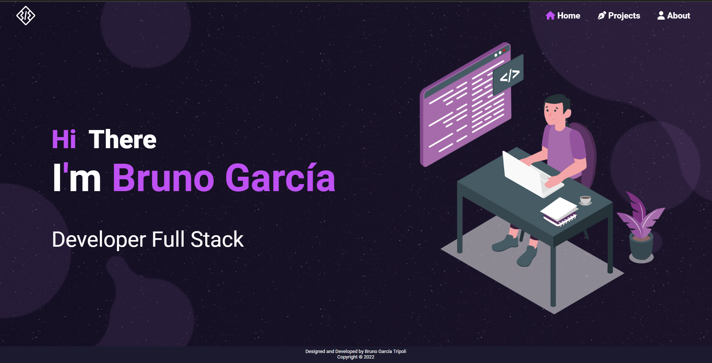

# JS-portfolio
On development project.

## Getting Started
Clone this repository. You will need to have ``node.js``, ``npm`` and ``git`` installed on your computer.
### 🛠 Installation and Setup Instructions
Install npm modules, run the command: ``npm install``
Extra setup for developers:
- Install EsLint globally ``npm install -g eslint`` or as development dependency with ``npm install -D eslint``
- If you are working with Visual Studio Code install EsLint extension.
- Go to ``File > Preferences > Settings`` and click the button to display json settings.
    - Add these 4 lines:
    ```
    "eslint.format.enable": true,
    "editor.codeActionsOnSave": {
        "source.fixAll.eslint": true
    }
    ```
#### Run in development mode
To run in development mode just run the command ``npm start`` and open [http://localhost:3000/](http://localhost:3000/) on your favourite browser.
#### Run in production mode
First, build the project with the command ``npm run build`` go to ``dist``:file_folder: folder and look for file ``index.html`` open this file with ``Live Server``.
